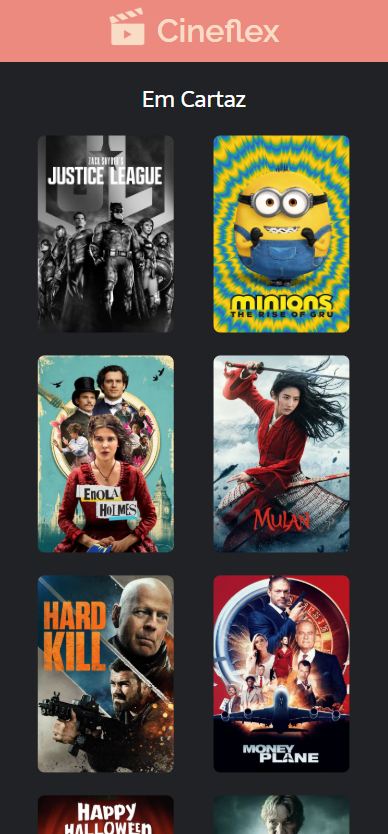
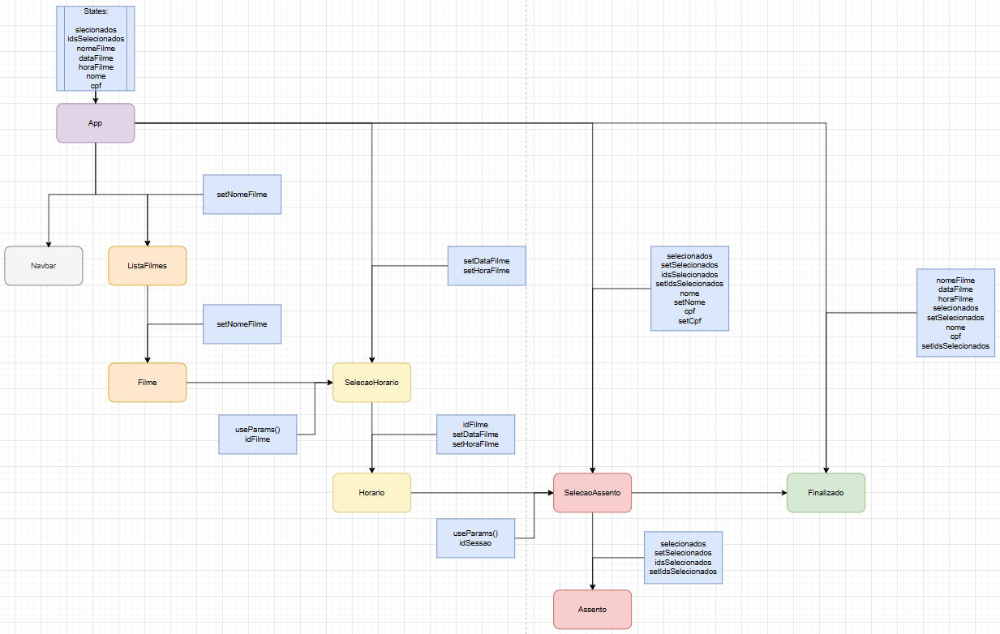

# Cineflex

Bem-vindo ao Cineflex, um aplicativo web intuitivo para reserva de assentos em sessões de cinema. Desenvolvido com React e criado com o Vite, este projeto oferece uma experiência de usuário flúida, desde a escolha do filme até a confirmação da reserva.



## 🚀 Funcionalidades

O CineFlex permite que os usuários realizem o processo de reserva de assentos de forma simples e eficiente, oferecendo as seguintes funcionalidades principais:

1. **Seleção de Filme:** Na tela inicial, o usuário pode escolher o filme desejado em uma lista de opções disponíveis.

2. **Seleção de Sessão (Data e Hora):** Após escolher o filme, o usuário é direcionado para uma página onde pode selecionar a data e hora da sessão de sua preferência.

3. **Seleção de Assentos:** Nesta etapa, é apresentado um mapa dos assentos da sala. Os assentos disponíveis são claramente indicados, enquanto os ocupados são exibidos como indisponíveis, com base nas informações da API. O usuário pode selecionar um ou mais assentos.

4. **Informações do Comprador:** Para finalizar a reserva, o usuário deve preencher campos com seu nome completo e CPF.

5. **Confirmação da Reserva:** Após selecionar ao menos um assento e preencher todas as informações do comprador, uma página de confirmação é exibida, resumindo todos os detalhes da reserva:

    * Nome do Filme

    * Data e Hora da Sessão Escolhida

    * Números dos Assentos Reservados

    * Nome e CPF do Comprador

6. **Voltar ao Início:** Um botão de fácil acesso permite que o usuário retorne à tela inicial para iniciar uma nova reserva ou explorar outros filmes.

## 💻 Tecnologias Utilizadas
* **React:** Biblioteca JavaScript para construção de interfaces de usuário.

* **Vite:** Ferramenta de build frontend que oferece uma experiência de desenvolvimento extremamente rápida.

* **API (para dados de filmes e assentos):** Integração com uma API para obter informações em tempo real sobre filmes, sessões e disponibilidade de assentos.

## 🌐 Deploy

Você pode acessar a aplicação em produção através do seguinte link:
[Cineflex](https://cineflex-xi-sand.vercel.app)

## 📊 Diagrama de Componentes



## 🛠️ Como Executar o Projeto Localmente

Para configurar e executar o projeto em sua máquina local, siga os passos abaixo:

1. **Clone o repositório:**
    ```bash
    git clone https://github.com/Karathus/cineflex.git
    ```
2.  **Navegue até a pasta do projeto:**
    ```bash
    cd cineflex
    ```
3.  **Instale as dependências:**
    ```bash
    npm install
    ```
4.  **Inicie o servidor de desenvolvimento:**
    ```bash
    npm run dev
    ```

O projeto estará rodando em `http://localhost:5173` (ou em outra porta, dependendo da sua configuração).

## Desenvolvedor

André Avelar